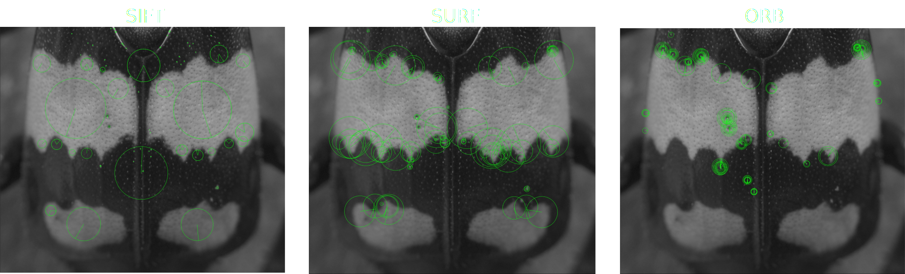

# Identifying individual burying beetles by unique elytral patterns

\

This project extended previous computer vision methods and software packages (particularly [I3S](https://reijns.com/i3s/)) to identify individuals in a wild population of burying beetles by photographic record alone. I established a protocol for image capture and photo-record processing that allows for thousands of images to be processed largely automatically, with error exceptions and verbose logging of issues at each stage. The pipeline annotates, crops, and rotates input images, extracts fingerprints from unique elytral patterns, and compares these patterns among thousands of potential matches. There is then a GUI written with PyQt for users to assign ultimate identities of individuals in the photographic record.

\

\

\

# Measuring flight behaviours in small-bodied insects

This project used a custom built [flightmill](https://kynandelaney.github.io/practical_projects.html) and raspberry pi data-logger to capture the flight activity of burying beetles. A time-series of rotation events was recorded and converted into traces of individual behaviours, capturing mean and momentary flight speed, periodicity, and other traits. 

\

\

# Future projects

Projects will be added here as related materials are published. Topics currently include survival analyses, mark-recapture demographic models, and colour analyses. R code for these projects, in the form of RMarkdown tutorials or github repositories, are prepared and will be made available as soon as possible.

\

\

------