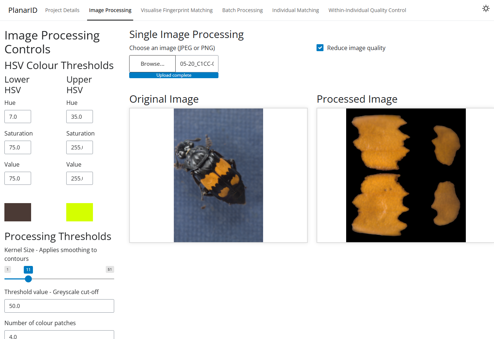
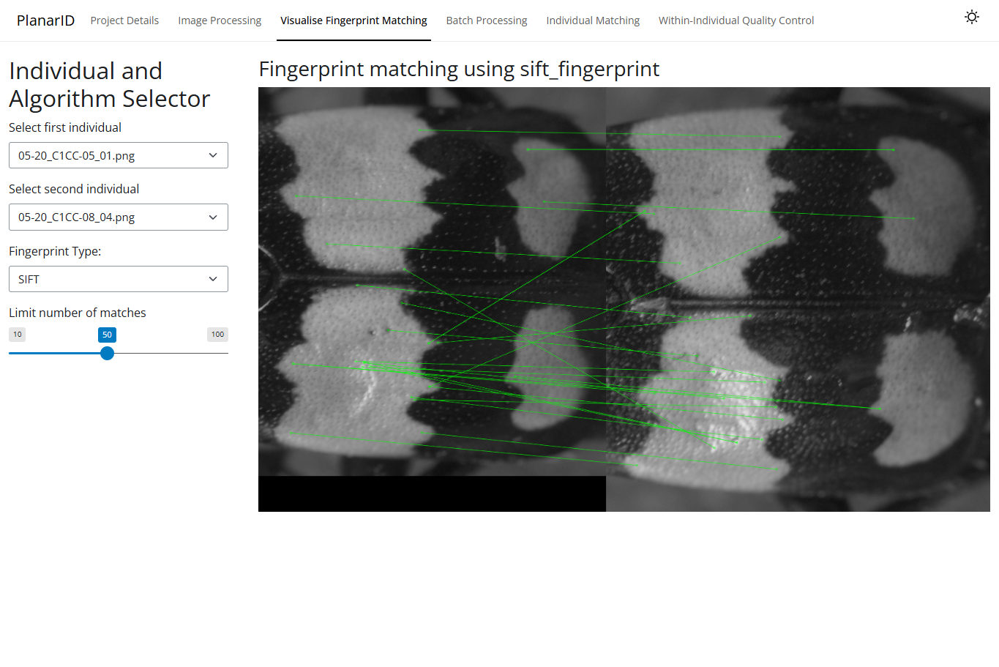
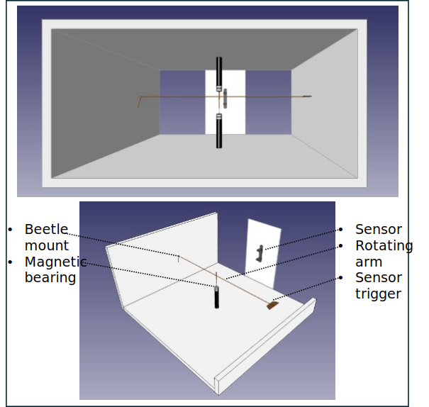
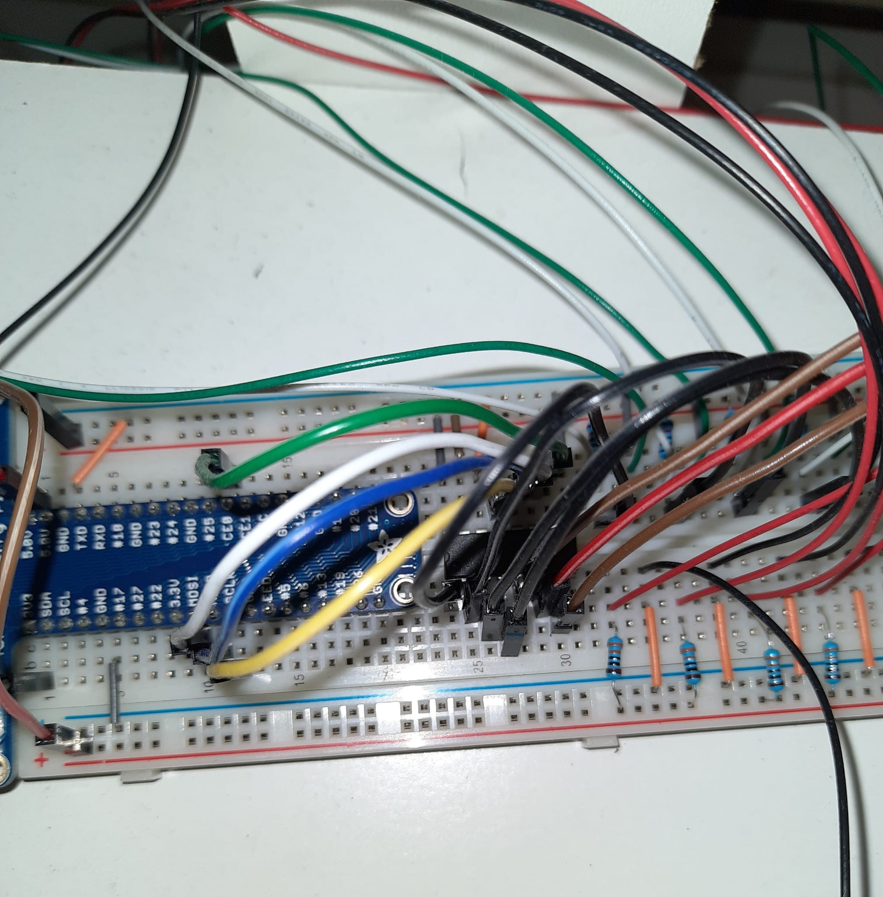

\

This site started as an exercise in using RMarkdown. I also wanted to showcase some projects and hobbies that I found fun and felt like sharing! The result is the present mix of HTML, CSS, R, and JavaScript. Included in this site are PDFs, 3D objects, videos and images. Please have a look around! I hope these elements are displayed properly on your device or browser, but if not, know I will be updating this site to improve compatibility over time.\ 

\

\

## [Coding Projects](coding_projects.html)

My interests in coding and solving invertebrate ecology problems during my PhD culminated in a computer-vision tool for identifying insects in the wild. Details of PlanarID can be found on my <a href="https://github.com/KynanDelaney/PlanarID">GitHub</a>, but I will be adding a set of tutorials and user manuals here soon.

A computer-vision dashboard for measuring startle responses and individual movement in static arenas will soon follow!

  
  
  

    The GUI of PlanarID – an individual recognition Shiny app I built to facilitate my PhD fieldwork.
  

## [Practical Projects](practical_projects.html)
More practical solutions to research questions have involved building data-loggers and sensor arrays for recording flight behaviours in small insects. With a Raspberry Pi, magnets, and an abundance of superglue, any problem can be solved! Python scripts and self-hosted PostgreSQL databases for data-logging also help.

  
  
  

    A schematic of a flight mill I built to measure flight performance in burying beetles. Also, a highly effective but confusing wiring setup for 7 flight chambers recording simultaneously.
  

------
