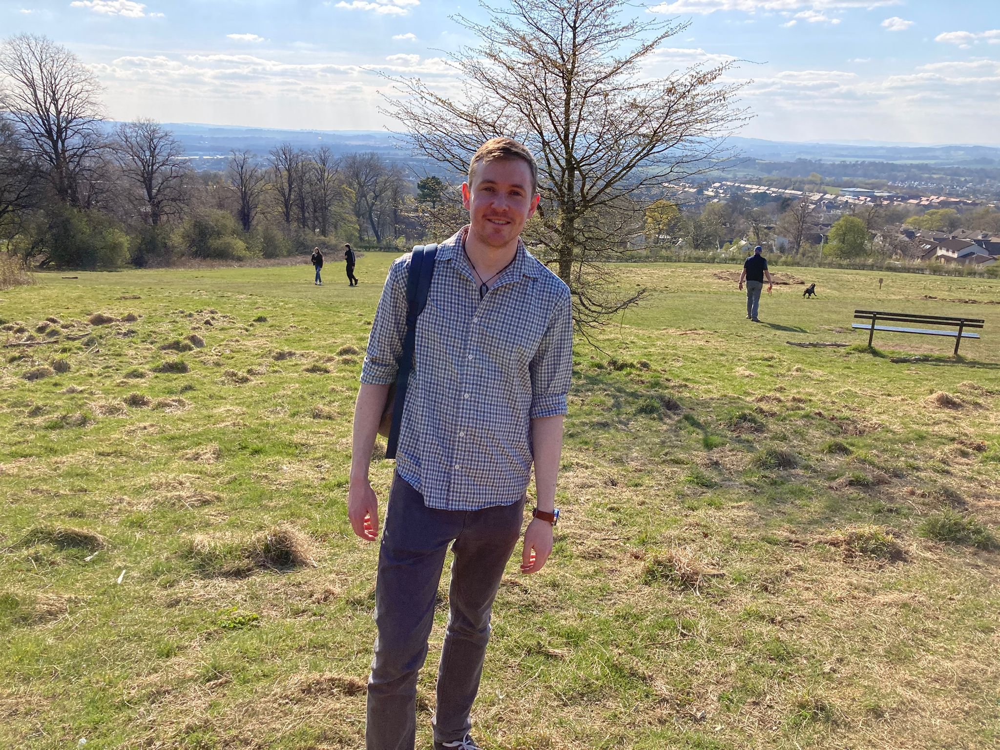

\

This site started as an exercise in using RMarkdown. I also wanted to showcase some projects and hobbies that connect to different skills. The result is the present mix of HTML, CSS, RMarkdown, Pagedown, and JavaScript. Included in this site are PDFs, 3D objects, videos and images. Please have a look around! I hope these elements are displayed properly on your device or browser, but if not, know I will be updating this site to improve compatibility over time.\ 

I aim to add R code tutorials and expanded access to GitHub repositories soon. 

\

\

------
